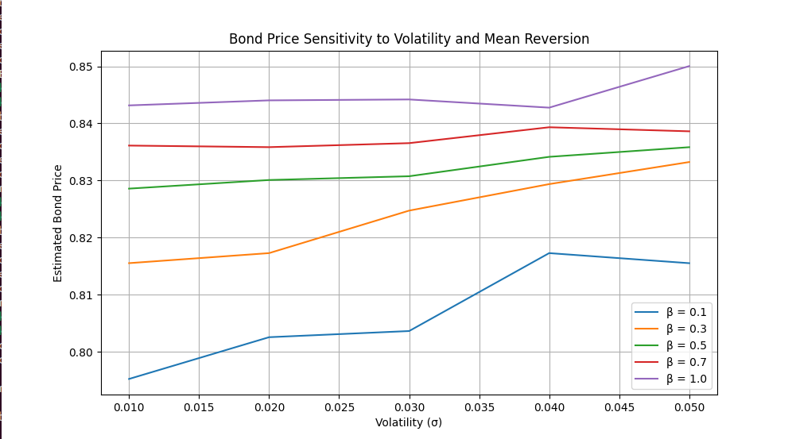
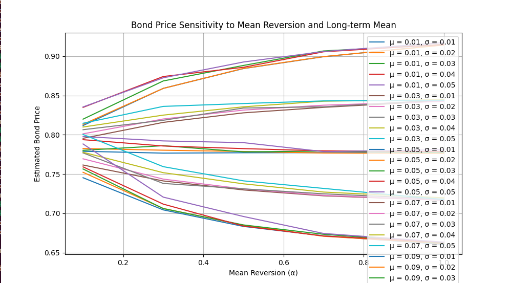
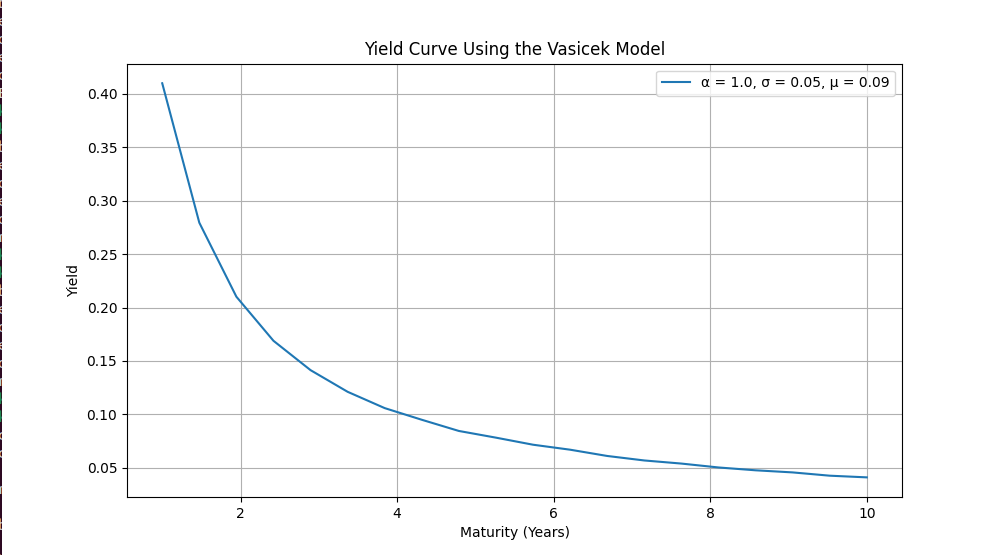

# Vasicek Interest Rate Model and Bond Pricing  

This project implements the **Vasicek interest rate model** to simulate interest rates and price zero-coupon and coupon bonds using both **Monte Carlo simulation** and a **closed-form solution**. It also extends the model to a **two-factor Vasicek model** for a more comprehensive analysis.

---

## Features
1. **Simulate Interest Rates**:
   - One-factor Vasicek model using the Euler-Maruyama method.
   - Two-factor Vasicek model with correlated Wiener processes.

2. **Bond Pricing**:
   - Price zero-coupon bonds using Monte Carlo and closed-form solutions.
   - Price coupon bonds using Monte Carlo simulation.

3. **Sensitivity Analysis**:
   - Explore bond price sensitivity to volatility, mean reversion speed, long-term mean, and time to maturity.

4. **Yield Curve Modeling**:
   - Generate and visualize yield curves based on different maturities.

---

## How to Run
1. **Clone the Repository**:
   ```bash
   git clone https://github.com/username/repo-name.git
   cd repo-name
2. **Run the script**:
   ```bash
   python main.py
3. **Provide inputs**:
 -Initial interest rate R0​.
 -Mean reversion speed α.
 -Long-term mean μ.
 -Volatility σ.
 -Time to maturity T.
 -Number of time steps and Monte Carlo paths.
 -Correlation between the two Wiener processes ρ (for the two-factor model).

## Mathematical Background
The Vasicek model is described by the following stochastic differential equation (SDE):
dRt=α(μ−Rt)dt+σdWt
dRt​=α(μ−Rt​)dt+σdWt​

Where:

    Rt​: Short-term interest rate at time tt.
    α: Mean reversion speed.
    μ: Long-term mean.
    σ: Volatility.
    Wt: Wiener process (Brownian motion).

The price of a zero-coupon bond maturing at T is given by:  
P(t,T)=A(t,T)⋅exp{−B(t,T)Rt}

Where: A(t,T) and B(t,T) are deterministic functions based on the Vasicek model parameters.

In the two-factor Vasicek model, two interest rates R1(t)and R2(t)follow correlated processes:  

dR1(t)=α1(μ1−R1(t))dt+σ1dW1(t)  
dR2​(t)=α2​(μ2​−R2​(t))dt+σ2​dW2​(t)


Where W1(t) and W2(t) are correlated Wiener processes with correlation ρ.

## Outputs

Zero-Coupon Bond Prices:

    Monte Carlo simulation and closed-form results.

Coupon Bond Prices:

    Prices based on periodic coupon payments and final principal repayment.

Yield Curves:

    Plots showing yields across various maturities.

Sensitivity Plots:

    Impact of varying parameters on bond prices.

## Inferences

One-Factor vs Two-Factor Models:

    The two-factor model captures additional market dynamics by introducing a second stochastic component.

Sensitivity Insights:

    Increasing volatility (σσ) decreases bond prices due to increased uncertainty.
    Faster mean reversion (αα) stabilizes rates, leading to more predictable bond prices.
    The long-term mean (μμ) significantly influences the level of the yield curve.

## Sensitivity Analysis Plot

Here is the sensitivity analysis plot for the model:





## Yield Curve Plot

Here is the Plot obtained by Yield curve modelling:



    
